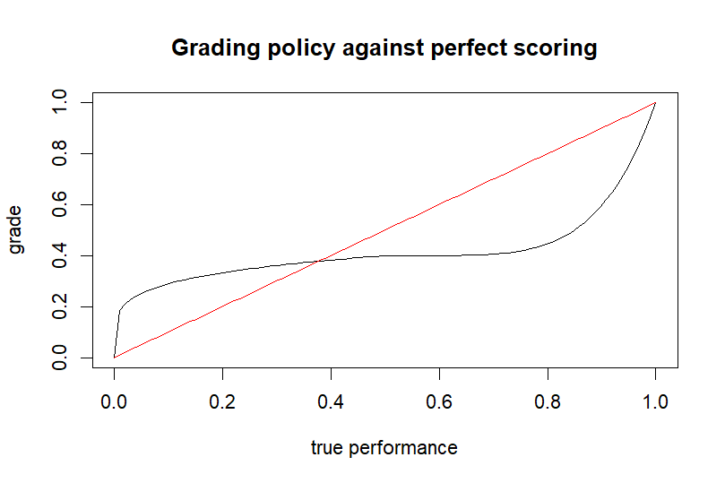
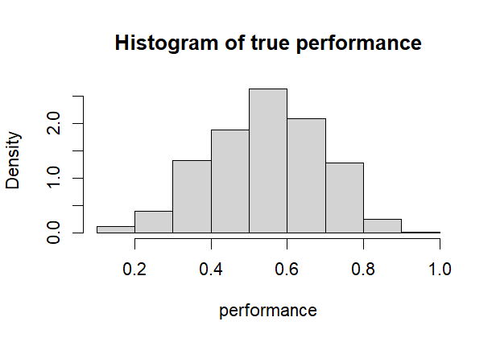
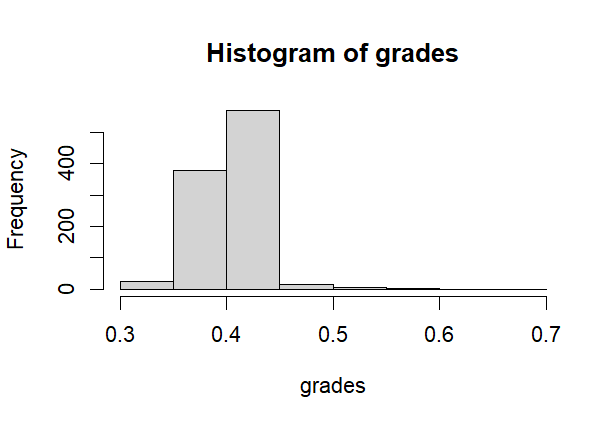

import Latex from "../../components/Latex.astro";

## Introduction
Good grading is art. It decides weither students feel fairly treated, equal chances arrise and is a good indicator of the students true performance.

When i took one of the most difficult exams in my studies-program in Data Science, we experienced something rather unusual. The grading-buckets were **extra ordenarily slim**. The difference between a 2.7 and 3.0 was merely one point. How could this be? We just assumed, that the distribution had it's mode behind the passing threshold and we were amongst the few lucky ones, that made it through the exam and the mode was just behind the passing threshold.

The ones that passed must have achieved tail-performance.

But then word spread, that the failure rate was around 50%. This was astonishing, because it implied, that the mode was around the passing threshold (assuming the grading statistic was normal.)

The true form of the distribution and the causes behind the grading-buckets being so small, remained a mystery to me and other students.

## My Hypothesis: It is not the exam, it is the grading
In the summer of this year, the university gave me the task of taking care of this years exam-coaching. Naturally i started thinking about tips, that could benfit ones grades and how to get more points from your solution.

I came to the conclusion, that there are two different scenarios, that would change the students approach to grading.

1. Grading a bad solution
2. Grading a good solution

Grading a bad solution requires you to think where you can **give** points. If there exist certain aspects of the solution, which also exist in the perfect one, then you can give points for that. 
- "The student knew what the general direction was"
- "The student was near to being on the right track to solve the exercise"

As a grader, you can give some amount of points for this (hypothetically up to 40%).

For grading a good solution, the mindset of the grader shifts. If all elements are there, you can look for differences to the perfect solution. You are therefore looking for points you can **take away** and not to give.
In this mindset you start with the full amount of points and then deduct points from there to get the grading.

Together this seems like fair grading. But the problem with this approach is, that:
1. **Bad solutions tend to be overvalued**
2. **Good solution tend to be undervalued**

If we plot this "grading-policy" you could end up with something like this:

## What influence has this on the grading statistics?
If we aim to model the effect the grading-policy we need to first define the general assumptions. A set of students have a true performance:
<Latex formula="p_i \overset {iid}\sim \text{Beta}(5.9, 4.2) \hspace{1em} i\in \{1,....,n\}" class="prose-not"></Latex>

This performance is then graded by the grading policy g:
<Latex formula="g_i = g(p_i), g: [0,1]\to[0,1]" class="prose-not"></Latex>

If we simulate n=1000 perfomances we get a very healthy performance distribution:

In this scenario 16% of the students fail and there is enough room for healthy grading-buckets.

But grading the performance with the policy from the last chapter leaves us with this distribution:

In this case we have:
- A very narrow tail to the right with mostly noise leading to very small grading-buckets
- A cluttering around the passing grade
- Failure rate shoots up to 40%.

**Because we overvalue bad solutions and undervalue good solutions, we take away the variance of the initial distribution.** 

## Conclusion and validity
In total i have reason to believe, that taking care of unbiasedness in the grading-system could greatly improve the experience for students taking the exam. Improvements could be:
- double the amount of points from 60 to 120 to allow for more nuanced grading
- take away less points for small notational mistakes to avoid undervaluing good performance
- Have very detailed ideas about what "being on the right track" means

But of course the simulation behind this is an exaggeration of reality. There can and will be other effects at play, that weren't modelled in this example.

I am also not saying grading of the exam is bad. I just want to emphasise, that the danger of bias is there and **can** lead to "unfair" grading.

The R-code for the simulation is available [here](https://github.com/Carsten134/grading_sim/tree/master).