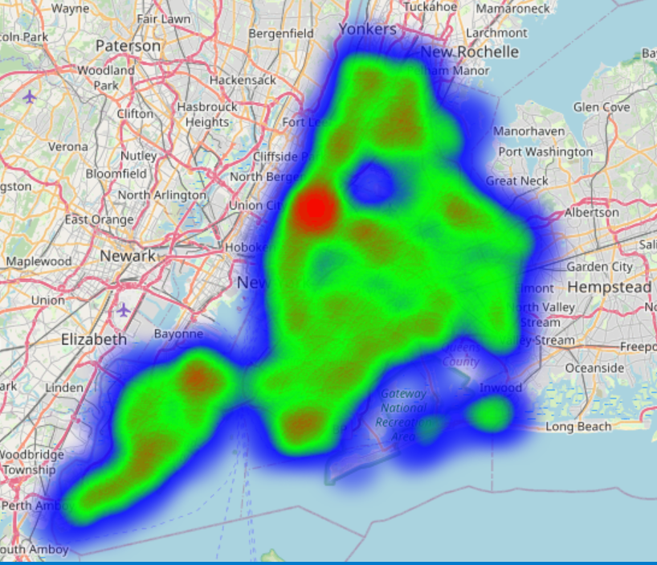
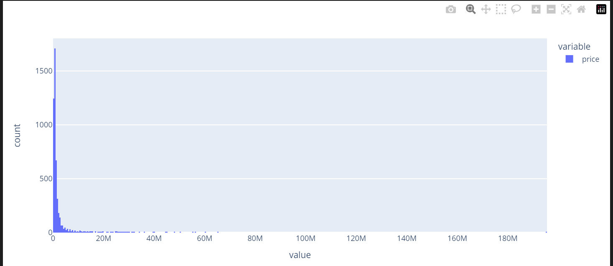
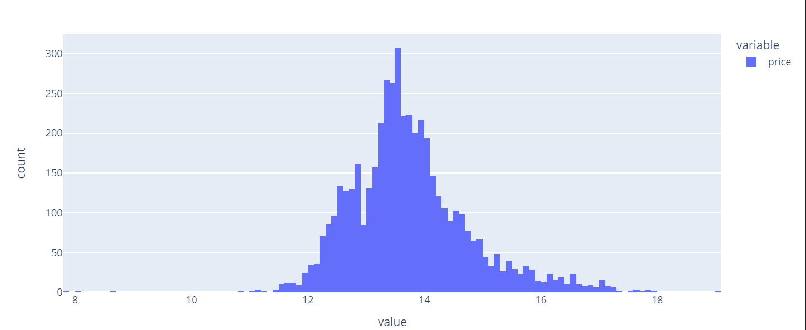

import Latex from "../../components/Latex.astro";


## Getting to know the New York City property market
This post is all about a dataset i found on [kaggle](https://www.kaggle.com/). I take you through the process of cleaning this [data](https://www.kaggle.com/datasets/nelgiriyewithana/new-york-housing-market) and discuss some key-insights, i found on the way.

### Introduction and motivation
Like stated in the last blog post about this website, the primary goal of this project was, to get familiar with the ususal workflow of a data-analysis. Part of this was learning numpy and pandas from scratch and finding not only clean data but also something, that was worth exploring and didn't have any complex dependencies (like trend or panel data). This is why i settled for a cross-sectional sample with some but not a lot of impurities.

This [dataset](https://www.kaggle.com/datasets/nelgiriyewithana/new-york-housing-market) was not only clean but contained real data, scraped from a listing website, called zillow. Here's a brief overview of what i did:
- find out about the origin of the data and determine the context
- clean the data
- do a very simple exploratory analysis on the data for:
    - each individual feature
    - dependencies on the price
    - geospacial properties

### Key findings and process
**About the origin**
I speculate, that the data was scraped (relatively recently) from zillow. It contaiend listings of properties all over NY and held very granular information about the location of the property and some information about the size (number of bedrooms, sqft. number of baths). The listings also held information about the status of the transaction (from *'for sale'* to *'pending'*). The data also was geocoded, likely by way of an API like openroute or mapbox. The data also seemed to be relatively up to date as most listings could easily be found by googling the address.

For cleaning the data i:
- checked for `NaN` values
- made the column names easier to use with pythonic snake case
- removed unnecessary prefixes and suffixes on `string` columns
- did some type conversion for ease of usage and interpretation
- checked for outliers
- corrected varying levels of granularity on one column
    - `sub_locality` held everything from neighbourhoods to whole boroughs

Key findings include:
- the `type` column of the data gave insights about the state of the transaction (from *for sale* all the way to *pending*)
    - this gave more information about meaning of each rows, as pending transactions weren't likely to change, while listings with no buyer were likely to change over time.
- The column `broker` gave insights about the marketshare of certain brokers. If they have a high marketshare, they are likely to have more controll over the price
    - knowing about the concentration of marketshare paves the way for economic models for marketdynamics
    - it turned out, that the concentration is very low
- Manhattan is by far the most expensive area to live (especially with billionares row)
- Some gated communities skew the price distribution to the right
- We see the bad reputation of the Bronx clearly reflected in the data
- The extraordenarily high prices on billionares row are also visible on the heatmap of the price (see below)



### Measuring market concentration
For measuring concentration we normaly use the **Gini-coefficient**:
<Latex formula="\text{Gini}=\sum_{i=1}^k p_i^2" class="prose-not"></Latex>
In this context i implemented the gini manually:
```python
# computing the percentages of marketshare
perc_marketshare = df["broker"].value_counts()/len(df)

market_gini = (perc_marketshare**2).sum()

print(f"Market gini coefficient: {np.round(market_gini*100, 2)}%")
```
Which lead to an output of `1.34%`. This is a very low concentration. The highest marketshare was near 10% and belonged to a brokerage called **COMPASS**.

Having a low market-concentration is favourable, because it puts pressure on supplieres to adjust the price for smaller margins in order to stay competitive. BUT: Taking into account the huge supply-problem with livingspace in NYC it comes as no surprise, that rent still remains extraordenarily high.


### Using interactivity to explore data
I used [folium](https://pypi.org/project/folium/) to visualize prices geo-spacially. Folium creates leaflet maps directly in your jupyter-notebook environment. This way i was able to look at the data at varying granularties in real time.


However, i ran into some problems, because you need to norm the data to a scale between 0 and 1. Using the max value this lead to values close to 0, because the pricerange is just so large and skewed to the right:


So i decided to log scale the price:


This made the data normally distributed and easier to scale with the percentage of the max, with most values settled around the 60-80% mark.

### Key takeaways for myself
Doing my first serious data analysis opened my eyes to various aspects of the process:
- you spend way more time understanding the data than i ever thought
- Doing research about the topic of your data, clearly helps
- Theres a lot of different directions you can go with an analysis. This also means you need to iterate and standardize the process of iteration


### What else can be done on top of this analysis
- You can do some feature-engeneering using routing APIs
    - reachability to potential work
- Apply interpretable machine-learning to find the greatest influences on the price

## Courious for more?
Check out the my [kaggle notebook](https://www.kaggle.com/code/carstenstahl/new-york-city-property-price-analysis) :).
